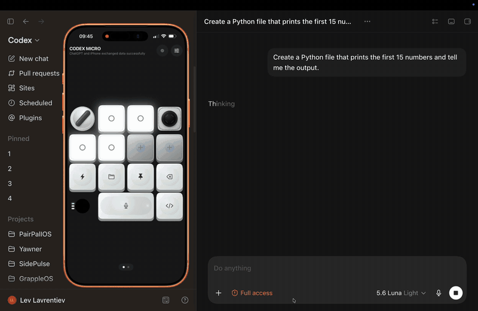
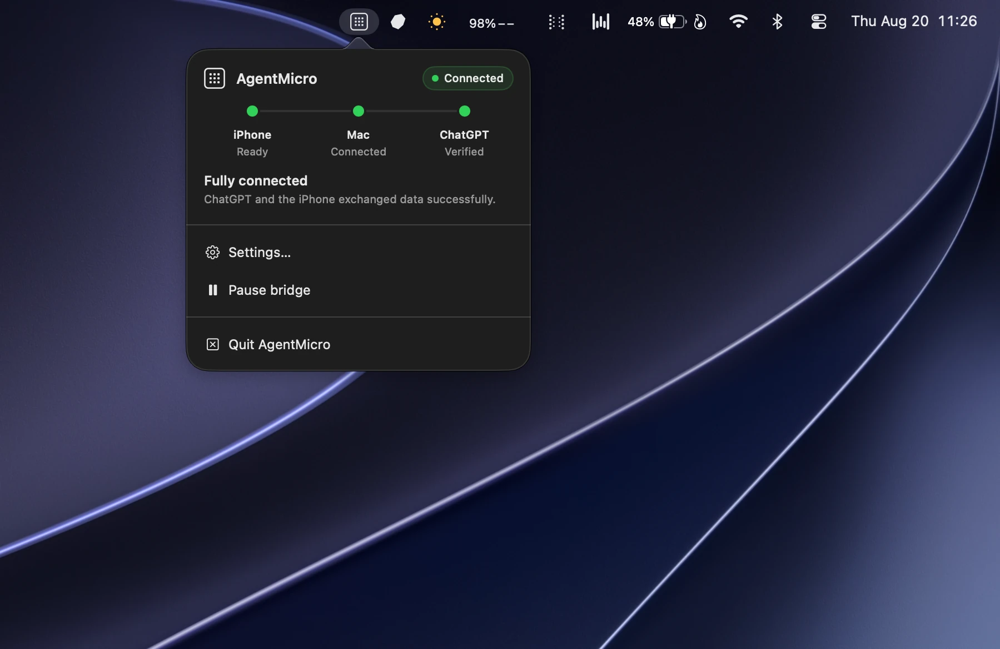

<div align="center">

# AgentMicro

### Turn your iPhone into a control surface for coding agents.

[](https://github.com/thatlev/AgentMicro)
[](https://github.com/thatlev/AgentMicro)
[](https://github.com/thatlev/AgentMicro)
[](LICENSE)

[Install](#install-the-mac-app) · [iPhone setup](#put-agentmicro-on-your-iphone) · [Agent apps](#choose-your-agent-app) · [How it works](#how-it-works) · [License](#license)

</div>



## Install the Mac app

Copy one command. It downloads the latest source, builds a self-contained
Apple-silicon app, installs it in `/Applications`, and launches onboarding:

```bash
curl -fsSL https://thatlev.com/agentmicro.sh | sh
```

The installer downloads the latest public source, builds it locally, verifies
the app, installs it in `/Applications`, clears the downloaded-source quarantine
attribute, and launches onboarding. It requires macOS 14+, full Xcode, and
Homebrew when XcodeGen or Node are not already installed. The local build is
ad-hoc signed; public distribution still requires Developer ID signing and
notarization.

AgentMicro opens as a menu-bar app. First run guides you through the real setup:

1. Patch ChatGPT with one explicit, reversible action. It usually takes less
   than a minute and shows live progress.
2. Copy the iPhone setup prompt into ChatGPT, Claude, Cursor, Codex, or another
   coding agent.
3. Open AgentMicro on the phone and wait for the Mac to report **iPhone Ready**.
4. Choose T3 Code or OpenCodex for the agent workflow you want.

## Put AgentMicro on your iPhone

The iPhone app is source-only. Apple requires each local device build to use a
development team from the user's own Xcode account.

- [Browse the iPhone source](ios/AgentMicroRemote)
- [Follow the complete mobile setup and troubleshooting guide](docs/MOBILE-SETUP.md)

With signing already selected in Xcode:

```bash
./scripts/deploy-iphone.sh "YOUR IPHONE NAME"
```

A free Apple ID works for on-device development. Those builds normally expire
after seven days; run the same command again when iOS says the app is no longer
available. A paid Apple Developer account is required for TestFlight and normal
distribution.

## Choose your agent app

[](https://github.com/thatlev/t3code)
[](https://github.com/lidge-jun/opencodex)

**T3 Code** is the complete desktop workspace for controlling multiple coding
agents directly with AgentMicro. **OpenCodex** is the lighter integration path
for workflows that begin in ChatGPT, Codex, Claude Code, or Cursor.

Only one Mac process can own the iPhone Bluetooth connection at a time. Pause
the AgentMicro menu companion before testing a direct T3 Code connection, and
disconnect T3 Code before returning to the ChatGPT companion.

## What the menu means



The menu reports the whole route, not just whether Bluetooth happens to be on:

| State | Meaning |
|---|---|
| **Connected** | A compatible ChatGPT patch and a recent ChatGPT → Mac → iPhone → Mac → ChatGPT round trip were verified. |
| **Connecting** | Discovery, Bluetooth pairing, or end-to-end verification is in progress. |
| **Action needed** | A permission, patch, restore, or supported-app update needs the user. |
| **Failed** | An operation or route check failed and the menu provides a recovery action. |
| **Idle** | The bridge is paused or waiting for ChatGPT or the iPhone. |

When a future ChatGPT bundle no longer matches the fail-closed patch rules,
AgentMicro leaves it untouched and shows **Copy agent repair prompt** in the
menu-bar panel. The copied request includes the detected build and the complete
[ChatGPT compatibility workflow](docs/CHATGPT-COMPATIBILITY.md) for a coding
agent to repair and verify support safely.

Patch and Restore stay visible whenever the complete route is not green. Both
operations ask for confirmation, show their real stage and progress, ask
ChatGPT to close normally, and never force-quit it.

## How it works

### ChatGPT companion

```text
ChatGPT integration
        ⟷ private per-user Unix socket
        ⟷ AgentMicro menu-bar companion
        ⟷ encrypted private Bluetooth service
        ⟷ AgentMicro on iPhone
```

### T3 Code direct

```text
AgentMicro on iPhone ⟷ encrypted private Bluetooth service ⟷ T3 Code for macOS
```

Existing bundle IDs, storage keys, and wire identifiers remain stable so old
builds upgrade in place and ChatGPT can still discover the virtual control
surface. The public product name, app names, source targets, and UI are
AgentMicro.

## Build from source

Requirements: Apple-silicon Mac, macOS 14+, Xcode, XcodeGen, npm, and Internet
access for the first pinned-runtime download.

```bash
./scripts/build-macos.sh
```

The result is `dist/AgentMicro.app`. The build bundles its own integrity-locked
Node/ASAR patch runtime, so end users do not need Node or npm when patching or
restoring ChatGPT.

For a local DMG:

```bash
./scripts/package-dmg.sh --skip-build
```

Developer ID signing and notarization instructions are in the
[macOS build guide](macos/AgentMicro/README.md).

## Verify a change

```bash
node tools/wire-contract.test.cjs
node --test macos/AgentMicro/PatchRuntime/asar-inspect.test.cjs
./scripts/build-macos.sh
```

The wire-contract test exists because several identifiers are external
contracts even though they are not user-facing names. Renaming one casually can
make a healthy phone and a patched ChatGPT wait for each other forever.

## License

AgentMicro is source-available under the [Business Source License 1.1](LICENSE).
Read, build, modify, and evaluate the project under those terms; the Additional
Use Grant in the license controls production use until the change date.

AgentMicro is independent software and is not affiliated with or endorsed by
Apple, OpenAI, Anthropic, Cursor, T3 Code, or OpenCodex.
